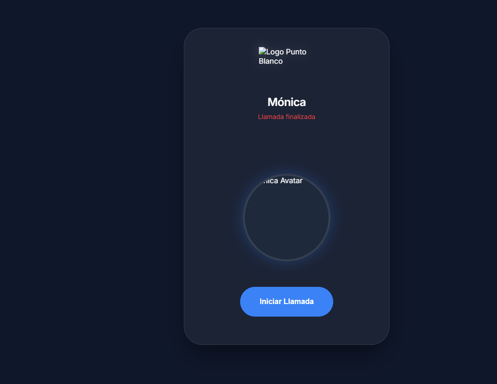

# Mónica - Bot de Voz (Sin LiveKit) 🦙

Este proyecto es un bot de voz a voz ultra-simple que utiliza **Groq** para la inteligencia y las **APIs de Voz del Navegador** para escuchar y hablar.

## Cómo Funciona
1.  **Escucha**: El navegador usa `SpeechRecognition` para convertir tu voz en texto.
2.  **Piensa**: El backend envía ese texto a **Groq (Llama 3)**.
3.  **Habla**: El navegador usa `SpeechSynthesis` para leer la respuesta de Mónica.

## Requisitos
- **Groq API Key**: Ya configurada en el `.env`.
- **Navegador**: Google Chrome o Microsoft Edge (recomendado por soporte de voz).

## Instalación
1. Instala las dependencias:
   ```bash
   python -m pip install -r requirements.txt
   ```

## Cómo Ejecutar
1. Inicia el servidor:
   ```bash
   python server.py
   ```
2. Abre tu navegador en `http://localhost:8080`.
3. Haz clic en **"Iniciar Llamada"** y permite el acceso al micrófono.

## Notas de Desarrollo
- El archivo `agent.py` contiene el prompt del sistema y la lógica de las funciones.
- El archivo `index.html` es la interfaz de "llamada" diseñada con estética premium.
